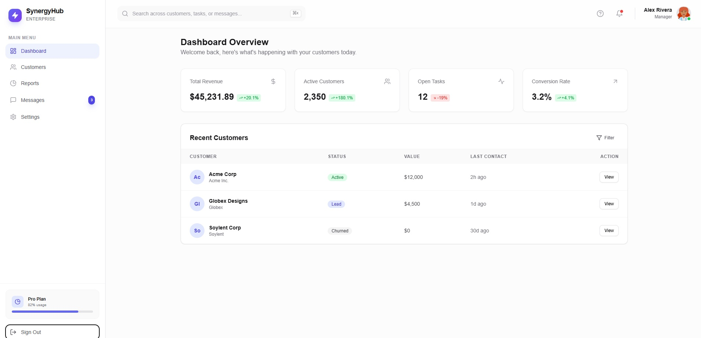
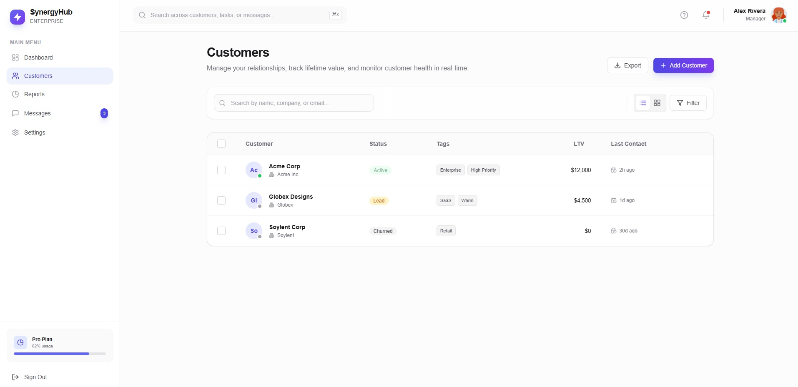
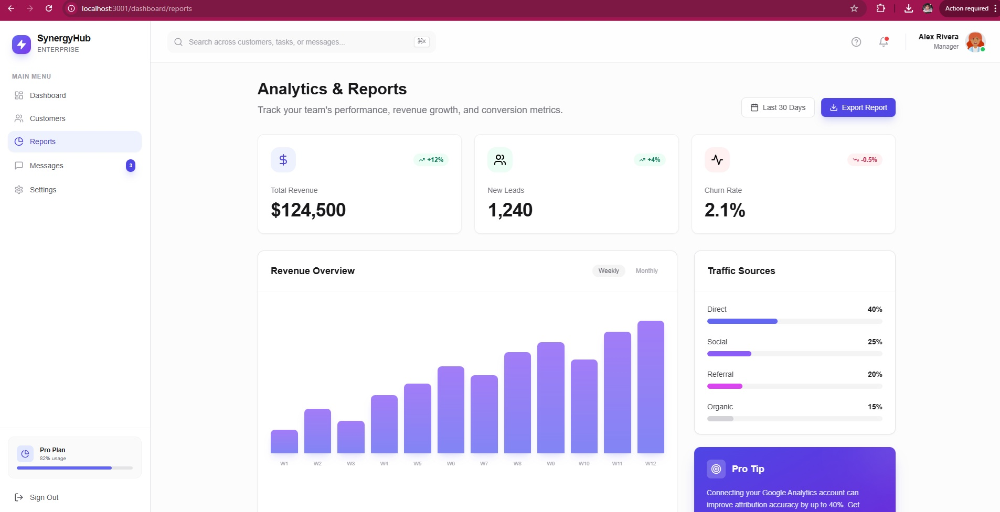
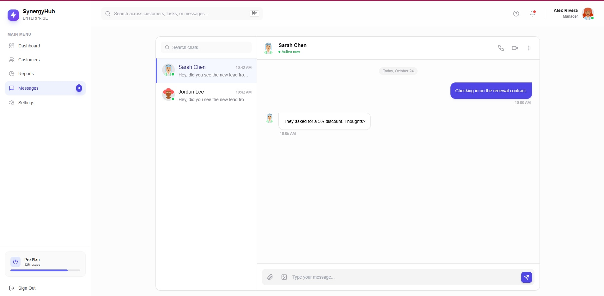
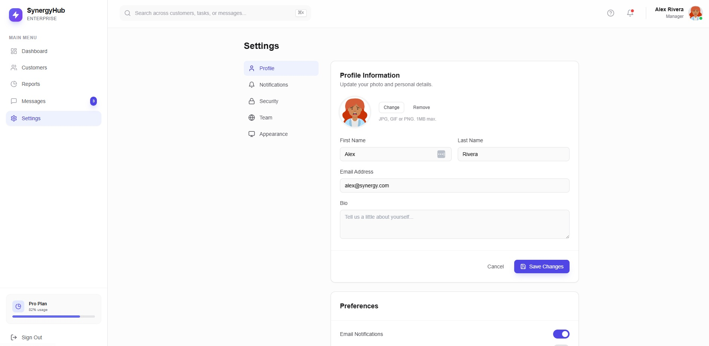

# SynergyHub CRM

**Live Demo:** [https://synergy-crm-flame.vercel.app/](https://synergy-crm-flame.vercel.app/)

SynergyHub is a modern, enterprise-grade CRM dashboard capable of managing customer relationships, tracking sales pipelines, and facilitating team collaboration in real-time. Built with performance and aesthetics in mind, it provides a seamless experience for growing teams.

## Features

### 1. Interactive Dashboard
Get a high-level overview of your business performance with real-time metrics, recent activities, and actionable insights.


### 2. Customer Management
Manage your customer database with advanced filtering, detailed profiles, and status tracking.


### 3. Detailed Reports
Visualize your data with interactive charts and graphs to track growth, revenue, and churn.


### 4. Real-Time Messaging
Collaborate with your team directly within the platform.


### 5. Configurable Settings
Customize your workspace, manage team members, and adjust system preferences.


## Tech Stack

- **Framework:** [Next.js](https://nextjs.org/)
- **Styling:** [Tailwind CSS](https://tailwindcss.com/)
- **Language:** [TypeScript](https://www.typescriptlang.org/)
- **Icons:** [Lucide React](https://lucide.dev/)
- **Animations:** [Framer Motion](https://www.framer.com/motion/)

## Installation

To run this project locally, follow these steps:

1. **Clone the repository:**
   ```bash
   git clone https://github.com/your-username/synergy-hub.git
   cd synergy-hub
   ```

2. **Install dependencies:**
   ```bash
   npm install
   ```

3. **Run the development server:**
   ```bash
   npm run dev
   ```

4. **Open your browser:**
   Navigate to [http://localhost:3000](http://localhost:3000) to view the application.

## Deploying on Vercel

This project is optimized for deployment on [Vercel](https://vercel.com/), the creators of Next.js.

1. **Push your code to a Git repository** (GitHub, GitLab, or BitBucket).
2. **Import the project** into Vercel.
3. **Select the Framework Preset** as "Next.js" (Vercel usually detects this automatically).
4. **Click Deploy**. Vercel will install dependencies and build the project.
5. Once deployed, you will receive a live URL similar to the demo link above.

## Build for Production

To create a production build locally:

```bash
npm run build
npm start
```
